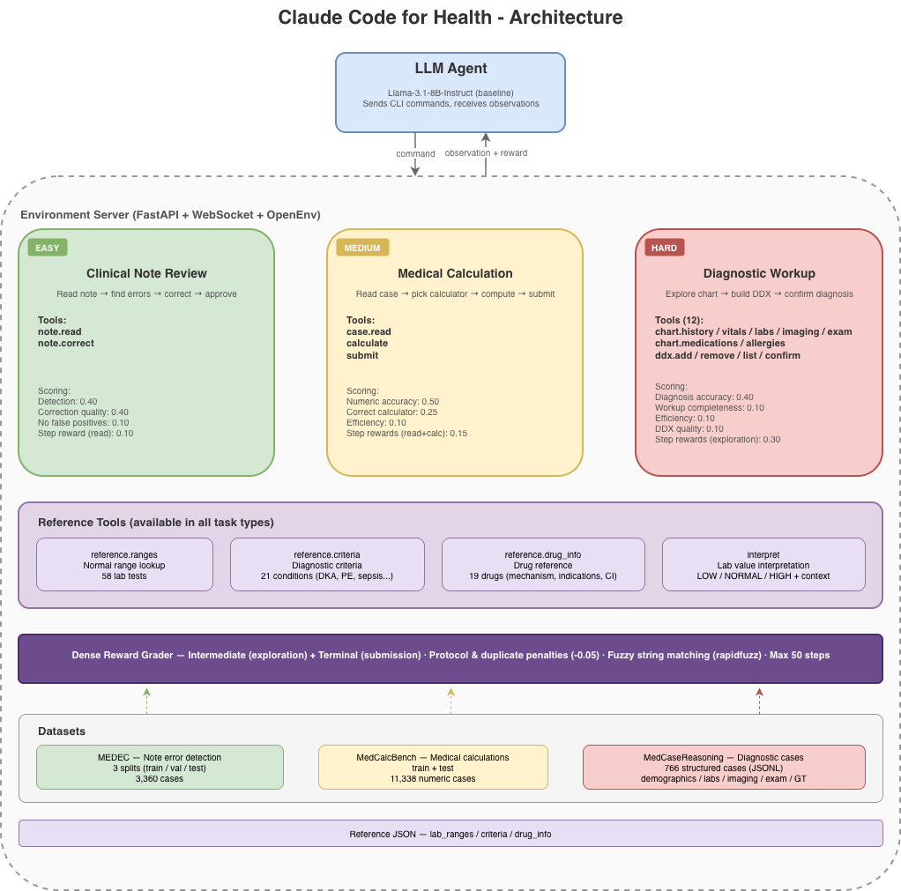

# Claude Code for Health

A clinical terminal OpenEnv environment where an AI agent works through medical tasks by typing CLI commands - the same interaction pattern as Claude Code, OpenCode, and Codex CLI for software engineering, but applied to healthcare.

Three task types across 15,000+ real medical cases, all programmatically graded with dense reward signals.

## Motivation

Medical errors are the third leading cause of death in the US. Training and evaluating AI agents on clinical reasoning is high-stakes but hard to benchmark - existing medical QA benchmarks (MedQA, USMLE) test static multiple-choice knowledge, not the sequential decision-making that real clinical work requires.

This environment fills that gap. An agent must actively explore patient data, use reference tools, build hypotheses, and commit to decisions - mirroring how clinicians actually work. The CLI-tool metaphor (inspired by Claude Code / aider for software) maps naturally to clinical workflows: you don't see the full picture upfront, you order tests and interpret results step by step.

Three task types test different cognitive demands - pattern recognition (note review), quantitative reasoning (calculations), and diagnostic reasoning (workup) - across 15,000+ real cases from peer-reviewed medical datasets.

## Architecture



## Tasks

| Task | Difficulty | Description | Dataset | Cases |
|---|---|---|---|---|
| **Clinical Note Review** | Easy | Read a clinical note, identify errors, correct them or approve | MEDEC | 3,360 |
| **Medical Calculation** | Medium | Read a patient scenario, identify the formula, compute the answer | MedCalc-Bench | 11,338 |
| **Diagnostic Workup** | Hard | Explore a patient chart via CLI tools, build a differential, confirm diagnosis | MedCaseReasoning | 766 |

## Datasets

- **MEDEC** - 3,360 clinical notes with annotated errors and corrections (3 splits: train / val / test)
- **MedCalc-Bench** - 11,338 medical calculation problems with ground truth answers and tolerance bounds (train + test)
- **MedCaseReasoning** - 766 structured clinical cases with demographics, vitals, labs, imaging, physical exam, and ground truth diagnoses (JSONL)

## Action / Observation Space

**Action** - single CLI command string per step:
```python
class MedAction(Action):
    command: str  # e.g. "chart.labs CBC", "submit 25.2", "note.correct 5 Fixed text"
```

**Observation** - command output + episode metadata:
```python
class MedObservation(Observation):
    output: str                    # Command output text
    error: str                     # Error message if command invalid
    available_commands: list[str]  # Tools available for current task
    task_type: str                 # diagnosis | calculation | note_review
    step_number: int
    max_steps: int                 # 50
```

**State** - episode tracking:
```python
class MedState(State):
    task_type: str
    difficulty: str        # easy | medium | hard
    total_score: float     # Cumulative reward
    commands_issued: int
    is_submitted: bool
```

## Available Tools

The environment simulates a real CLI tool interface - the same interaction pattern used by Claude Code, OpenCode, and Codex CLI for software engineering, but applied to clinical medicine. The agent issues text commands one at a time, receives structured output, and decides what to do next. No menus, no dropdowns - just a terminal and clinical judgment.

### Diagnosis Tools
```
chart.history              View past medical history, medications, allergies
chart.vitals               View vital signs
chart.labs [panel]         View lab results (list panels or view specific)
chart.imaging [type]       View imaging findings
chart.exam [system]        View physical exam findings
chart.medications          View current medications
chart.allergies            View known allergies
ddx.add <diagnosis>        Add to differential
ddx.remove <diagnosis>     Remove from differential
ddx.list                   Show current differential
ddx.confirm <diagnosis>    Submit final diagnosis (ends episode)
```

### Calculation Tools
```
case.read                  Read the full patient note + question
calculate <name>           Declare which calculator you're using
submit <number>            Submit numeric answer (ends episode)
```

### Note Review Tools
```
note.read                  Read the clinical note with numbered sentences
note.correct <id> <text>   Correct a sentence by ID
note.approve               Approve note / submit corrections (ends episode)
```

### Reference Tools (all tasks)
```
reference.ranges <test>           Normal range lookup (e.g. sodium, troponin)
reference.criteria <condition>    Diagnostic criteria (e.g. DKA, sepsis, PE)
reference.drug_info <drug>        Drug mechanism, indications, contraindications
interpret <test> <value>          Interpret a lab value against normal range
```

## Reward Design

Dense rewards over the full trajectory. Every step can yield signal, not just the terminal action.

| Task | Intermediate Budget | Terminal Budget | Total |
|---|---|---|---|
| Note Review | 0.10 (read note) | 0.90 (detection + correction quality) | 1.0 |
| Calculation | 0.15 (read case + declare calculator) | 0.85 (numeric accuracy + correct calculator + efficiency) | 1.0 |
| Diagnosis | 0.30 (chart exploration credit per relevant section) | 0.70 (diagnostic accuracy + workup completeness + efficiency + reasoning) | 1.0 |

**Penalties:**
- Protocol violations: -0.05 (imaging without vitals, confirming with <2 differentials, specialized labs without basic panels)
- Duplicate tool calls: -0.05

## Baseline Scores

Model: `meta-llama/Llama-3.1-8B-Instruct` via HuggingFace Router (20 runs):

| Task | Avg Score | Min | Max |
|---|---|---|---|
| Easy (note review) | 0.49 | 0.19 | 0.73 |
| Medium (calculation) | 0.27 | 0.01 | 0.84 |
| Hard (diagnosis) | 0.22 | 0.12 | 0.41 |

## Example Episode (Diagnosis - Hard)

```
> reset(options={"task": "hard"})
Patient: 45M, presenting with fever, rash, and joint pain
Type 'help' for available tools.

> chart.history                                        reward: +0.02
PMH: None significant
Medications: None
Social: Non-smoker, occasional alcohol

> chart.vitals                                         reward: +0.02
BP: 130/85 | HR: 102 | Temp: 39.2C | RR: 18 | SpO2: 98%

> chart.labs                                           reward: 0.00
Available lab panels: CBC, BMP, inflammatory_markers, LFTs

> chart.labs inflammatory_markers                      reward: +0.02
inflammatory_markers:
  ESR: 85 mm/hr
  CRP: 12.4 mg/dL
  Ferritin: 26,250 ng/mL

> reference.ranges ferritin                            reward: 0.00
FERRITIN: Normal range 12-300 ng/mL
  Female 12-150, Male 12-300. Very high in HLH, Still disease

> interpret ferritin 26250                             reward: 0.00
FERRITIN 26250.0 ng/mL: HIGH - critically elevated (normal 12-300)
  Female 12-150, Male 12-300. Very high in HLH, Still disease

> reference.criteria hlh                               reward: 0.00
HLH (HScore): Fever, organomegaly, cytopenias (2-3 lineages),
hypertriglyceridemia (>=265) or hypofibrinogenemia (<=150),
ferritin >=500 (often >10,000), elevated soluble CD25...

> ddx.add HLH                                         reward: 0.00
Added 'HLH'. Differential has 1 entry(ies).

> ddx.add Adult-onset Still disease                    reward: 0.00
Added 'Adult-onset Still disease'. Differential has 2 entry(ies).

> ddx.confirm Adult-onset Still disease                reward: +0.34
Diagnosis submitted: 'Adult-onset Still disease'. Score: 0.34

[STATUS] DDX: [HLH, Adult-onset Still disease] | Step: 10/50
Total episode score: 0.40
```

The agent earned intermediate rewards for each relevant chart section explored (+0.02 each), used reference tools to interpret the critically elevated ferritin (no reward, but informed its reasoning), built a 2-item differential (avoiding the -0.05 penalty), and got partial terminal credit for a close but not exact diagnosis match.

## Setup

```bash
# Install
uv sync

# Run server
uv run uvicorn server.app:app --port 8000

# Run inference (set HF_TOKEN first)
export HF_TOKEN="your_token"
uv run python inference.py
```

## Docker

```bash
docker build -t claude_code_for_health .
docker run -p 8000:8000 claude_code_for_health
```

## Environment Variables

| Variable | Description | Default |
|---|---|---|
| `API_BASE_URL` | LLM endpoint | `https://router.huggingface.co/v1` |
| `MODEL_NAME` | Model identifier | `meta-llama/Llama-3.1-8B-Instruct` |
| `HF_TOKEN` | HuggingFace API key | (required) |
| `IMAGE_NAME` | Docker image for `from_docker_image()` | (optional) |

## Project Structure

```
claude_code_for_health/
├── Dockerfile              # Container image definition
├── openenv.yaml            # OpenEnv manifest
├── pyproject.toml          # Dependencies
├── inference.py            # Baseline inference script
├── models.py               # MedAction, MedObservation, MedState
├── client.py               # EnvClient wrapper
├── __init__.py             # Module exports
├── data/
│   ├── MedCaseReasoning/   # Diagnosis cases (JSONL)
│   ├── MedCalcBench/       # Calculation cases (CSV)
│   ├── MEDEC/              # Note review cases (CSV)
│   └── reference/          # Lab ranges, criteria, drug info (JSON)
└── server/
    ├── app.py              # FastAPI application
    ├── claude_code_for_health_environment.py  # Core environment
    ├── command_parser.py   # CLI command parsing
    ├── data_loader.py      # Dataset loading
    ├── task_configs.py     # Difficulty tiers + case selection
    ├── graders.py          # Dense reward functions
    ├── constants.py        # Reference data loader
    └── ui.py               # Custom Gradio dashboard
```
